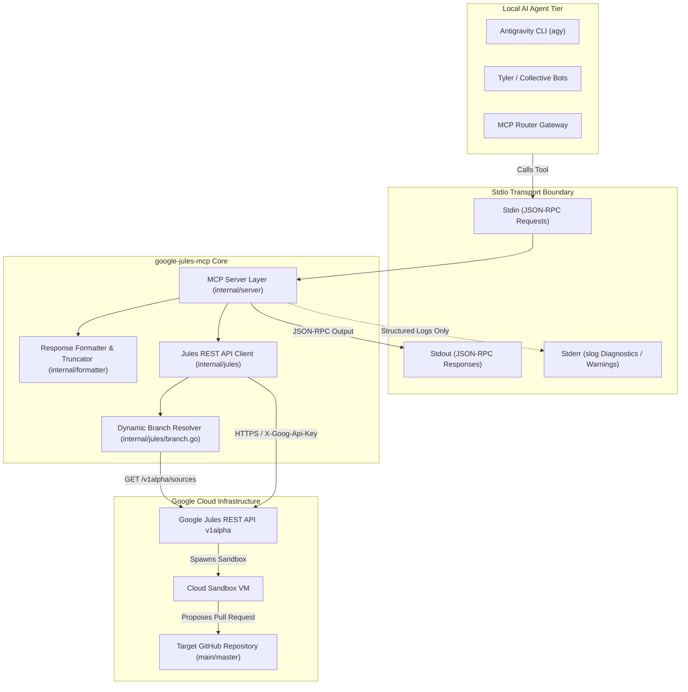
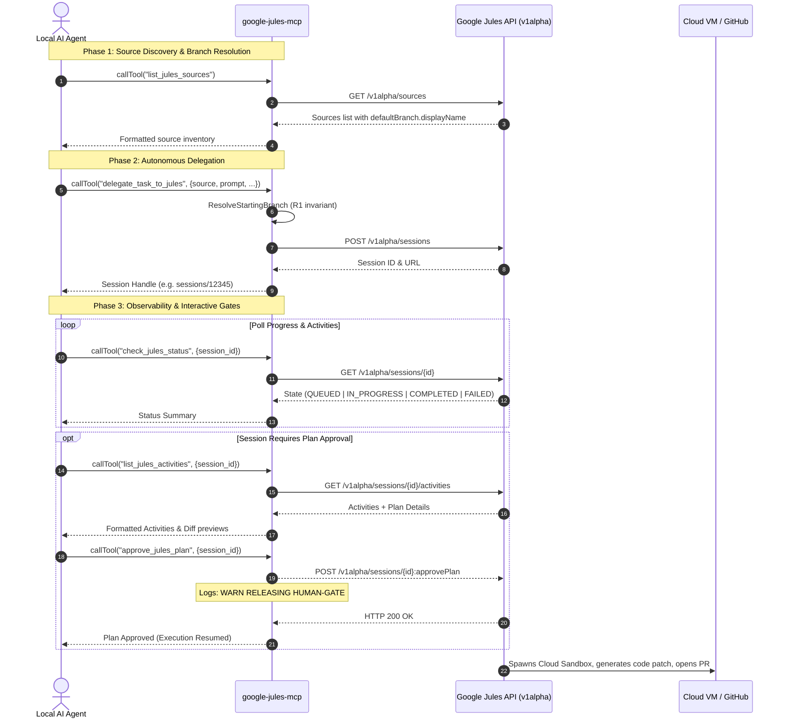

# 🏛️ Architecture & System Design — Google Jules MCP Server

This document details the architectural design, component topology, lifecycle workflows, and security guardrails of **`google-jules-mcp`** — the high-performance Go MCP server bridging autonomous AI agents with Google Jules cloud infrastructure.

---

## 1. System Topology & Context

The server operates as a stateless, lightweight bridge using the standard Model Context Protocol (stdio transport). It multiplexes control and observability between local AI agents (such as Antigravity, Tyler Durden, or MCP Router) and Google Jules cloud virtual machines executing in Google Cloud Platform (GCP).

---

## 2. Package Decomposition

The codebase is engineered strictly in Go (Go 1.22+ compatible) with zero external CGO dependencies and clean separation of concerns:

| Package | Path | Responsibility |
| :--- | :--- | :--- |
| `main` | `cmd/google-jules-mcp` | Application entry point. Loads `.env`, configures `slog` to `os.Stderr`, initializes dependencies, and binds to `mcpserver.ServeStdio`. |
| `server` | `internal/server` | MCP tool handlers and lifecycle registry. Implements 7 canonical tools, argument validation, and contract tests against `README.md`. |
| `jules` | `internal/jules` | Resilient HTTP REST client for Google Jules API (`https://jules.googleapis.com/v1alpha`). Implements exponential backoff, retry jitter, typed data models, and branch resolution. |
| `formatter` | `internal/formatter` | Context-window hygiene layer. Formats structured Markdown, truncates diffs ($\le 300$ chars) and prompt echoes ($\le 200$ chars), and prevents LLM context exhaustion. |

---

## 3. Tool Lifecycle & Sequence Flow

Google Jules tasks run asynchronously over extended durations (5–15 minutes). The server models execution through a complete 7-tool lifecycle:

---

## 4. Architectural Invariants (JMC-TUNE-1 Standards)

Every modification to this codebase must conform to the formal **JMC-TUNE-1** specification:

1. **R1: Dynamic Branch Resolution:**
   - Literal fallbacks like `"main"` are strictly prohibited.
   - If a repository's default branch is `master`, `ResolveStartingBranch` resolves and passes `"master"`.
   - If the repository is unknown or has no default branch metadata, the `startingBranch` parameter is omitted to let the Google API handle its internal defaults.
2. **R2: Complete Lifecycle Surface:**
   - Exactly 7 tools (`list_jules_sources`, `delegate_task_to_jules`, `check_jules_status`, `get_jules_session`, `list_jules_activities`, `send_jules_message`, `approve_jules_plan`) are maintained.
3. **R3: Context Window Protection:**
   - Unstructured raw dictionary dumps are forbidden.
   - Patch previews are strictly capped at $\le 300$ characters.
   - Echoed prompts are truncated at $\le 200$ characters.
   - Activity streams are capped at $\sim 4$ KB maximum payload.
4. **R4: Human-Actionable Error Taxonomy:**
   - Upstream HTTP error codes are translated into descriptive, diagnostic messages:
     - `400`: Upstream parameter error.
     - `401 / 403`: Invalid or revoked `JULES_API_KEY`.
     - `404`: Session or source not found.
     - `429`: Rate limit encountered, reporting retry attempts.
     - `5xx`: Google Cloud outage or internal server error.
5. **R5: Guardrails on Mutation & Human Gates:**
   - Background auto-watchers and unmonitored polling loops are forbidden.
   - The `approve_jules_plan` action triggers an explicit structured log:  
     `s.logger.WarnContext(ctx, "RELEASING HUMAN-GATE: approve_jules_plan invoked", ...)`
6. **R6: Automated Contract Synchronization:**
   - `TestReadmeMatchesToolRegistry` asserts in CI that `README.md` exactly reflects the registered MCP tool set.

---

## 5. Stdio Transport Hygiene

MCP stdio servers exchange JSON-RPC packets across standard operating system descriptors. A single spurious byte written to `stdout` corrupts the client's JSON framing parser:

- **`os.Stdout`:** Exclusively owned by `github.com/mark3labs/mcp-go/server`. Absolutely no application code may call `fmt.Println`, `os.Stdout.Write`, or standard `log` without redirection.
- **`os.Stderr`:** Exclusively utilized for all diagnostic output, metrics, and structured logging using `log/slog.NewTextHandler(os.Stderr, ...)`.
- **`os.Stdin`:** Exclusively read by the JSON-RPC message loop.

---

## 6. Resilience & Backoff Topology

Network interactions with Google Cloud implement an exponential backoff strategy with jitter:

$$\Delta t = \min(t_{\text{max}}, t_{\text{base}} \times 2^{\text{attempt}}) \pm \text{jitter}$$

- **Base Delay:** 500 ms
- **Max Delay:** 8,000 ms
- **Max Attempts:** 4
- **Deterministic Testing Override:** `JULES_DISABLE_RETRY=true` disables retry loops to prevent artificial latency in test suites.
