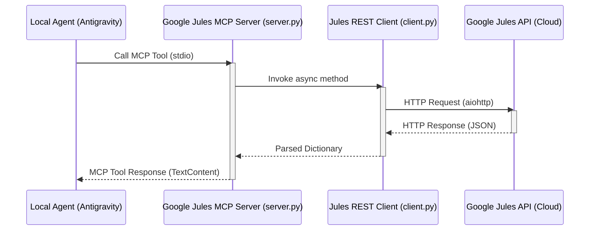

# Architecture

This document describes the architectural design and data flow of the **Google Jules MCP Server**.

## High-Level Architecture Diagram

The system operates as an intermediary Model Context Protocol (MCP) server, bridging local AI agents (like Antigravity) with the remote Google Jules AI Agent via a REST API.

## Module Interactions and Under-the-Hood Logic

The project is structured into two primary components:

### 1. The MCP Server (`src/server.py`)
This module acts as the entry point for the MCP protocol, utilizing standard I/O (`stdio`) for communication with the host agent.
- **Tool Registration**: It uses the `mcp.server.Server` class to expose tools (`list_jules_sources`, `delegate_task_to_jules`).
- **Request Handling**: Upon receiving a tool call, it validates the arguments (e.g., ensuring `source_name` and `prompt` are provided for delegation).
- **Error Management**: It safely catches exceptions and returns them as formatted `TextContent` to the calling agent, ensuring the local agent doesn't crash on API failures. It also verifies the presence of the `JULES_API_KEY` before executing tool logic.

### 2. The REST API Client (`src/client.py`)
This module encapsulates the HTTP communication with the Google Jules `v1alpha` API.
- **Async I/O**: It utilizes `aiohttp.ClientSession` for non-blocking network requests, which is crucial for an MCP server to remain responsive.
- **Session Management**: A new `ClientSession` is context-managed within the `_request` method to handle headers (including `x-goog-api-key`) and payload transmission.
- **Data Transformation**: It serializes Python dictionaries into JSON payloads for POST requests and deserializes JSON responses back into Python dictionaries for the server module to process.
- **Error Handling**: The client inspects the HTTP response status. If a request is not successful (`not response.ok`), it extracts the error text and raises an `HTTPException` via `raise_for_status()`, which is then caught by the server module.

### TODO
- **Connection Pooling**: Currently, a new `aiohttp.ClientSession` is created per request in `_request()`. For higher throughput, session management could be optimized to reuse a single persistent session across the lifecycle of the MCP server.
